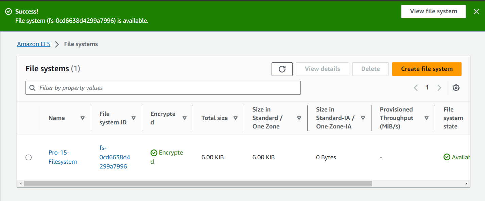
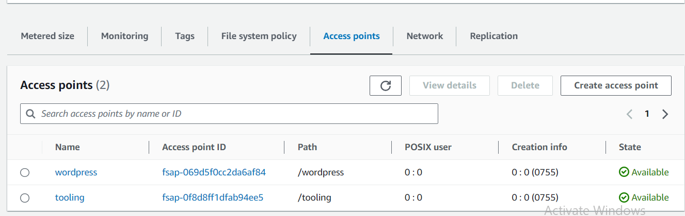

AWS CLOUD SOLUTION FOR 2 COMPANY WEBSITES USING A REVERSE PROXY TECHNOLOGY

1.0 Create a VPC

2.0 Enable DNS Hostname

3.0 Create Internet Gateway and attach it to our VPC

4.0 Create the subnets

Click on the Subnets and you will see subnets that are associated with default VPC;

The click on "Create Subnet" to create the subnets that will be associated with this our "Pro-15-VPC"

This is the public subnet created

Then create the Private subnets based on the design

5.0 Create Route Table:

5.1 Create Public and Private Subnet Route Tables;

6.0 Associate the public subnet to the public route table and Private subnet to the Private route table;

7.0 Configure the route tables accordingly;
This is the public route table config;

The Private route will be routed to through NAT Gateway, so we will have to create the NAT Gateway first. Also we will asign Elastic IP to the NAT Gateway.
First of all, allocate Elastic IP, then associate it to the NAT Gateway;

8.0 Create a Security Group for:
* Nginx Servers: Access to Nginx should only be allowed from a Application Load balancer (ALB). At this point, we have not created a load balancer, therefore we will update the rules later. For now, just create it and put some dummy records as a place holder.
* Bastion Servers: Access to the Bastion servers should be allowed only from workstations that need to SSH into the bastion servers. Hence, you can use your workstation public IP address. To get this information, simply go to your terminal and type curl www.canhazip.com
* Application Load Balancer EXTERNAL and INTERNAL: ALB will be available from the Internet
* Webservers: Access to Webservers should only be allowed from the Nginx servers. Since we do not have the servers created yet, just put some dummy records as a place holder, we will update it later.
* Data Layer: Access to the Data layer, which is comprised of Amazon Relational Database Service (RDS) and Amazon Elastic File System (EFS) must be carefully desinged – only webservers should be able to connect to RDS, while Nginx and Webservers will have access to EFS Mountpoint.

9.0 The next thing we gonna create now is the certificate;
NB: Before creating the certificate, i have purchased a Domain Name for NameCheap Domain Registerar. Also this domain name is transfered to aws;

Then go to aws certificate manager to create a certificate and attach it to a domain name. Why we are creating the certificate first is that when am creating the actual load balancer I will need to select a certificate bcos the instances behind the actual load balancer will listen on port 443, so we will need to select the certificate for that.

10.0 Create aws EFS;
Sear for aws EFS in your console, 

The next thing we gonna create is the access point; 
Access point is what will specify to the webservers to mount with. Here we have tooling webserver and wordpress webservers. So we are going to create two access points; one for tooling and one for wordpress webservers;
NB: You should never mount two servers on a single access point otherwise the servers will overwrite each others. This will mess up our infratructures.

So these two access point above is created

11.0 Create aws RDS

Before we create our RDS, there are two things we need to do, first, create a KSM key and a KSM Store and secondly we need to create a subnet group.

Setup RDS
Pre-requisite: Create a KMS key from Key Management Service (KMS) to be used to encrypt the database instance.
Amazon Relational Database Service (Amazon RDS) is a web service that makes it easier to set up, operate, and scale a relational database in the AWS Cloud. It provides cost-efficient, resizable capacity for an industry-standard relational database and manages common database administration tasks.
